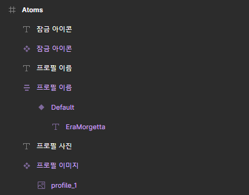
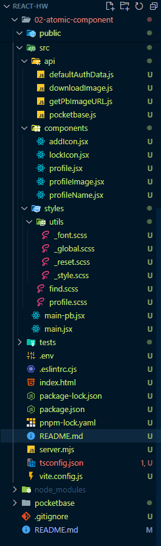

# [1주차 주말 과제] 아토믹 컴포넌트 만들기

## 과제 주제

바닐라 프로젝트 결과물 중 일부를, 리액트를 사용해 아토믹 컴포넌트로 구현하는 실습을 진행합니다.

## 과제 내용

### 아토믹 디자인 선정

제가 속한 3조는 TAING을 주제로 바닐라 프로젝트를 진행하였습니다.

이 중, 아토믹 디자인과 연관된 아토믹 컴포넌트를 구현하기 위해 선택한 컴포넌트는 '프로필 페이지'의 프로필입니다.


### Figma 컴포넌트 구현

**[Atomic Design - Figma 링크](https://www.figma.com/design/fNX8NC3Ei6PWfloVm3L4Mc/Atomic-Design---hsw?node-id=0-1&t=dm36JteUSbEZKc05-1)**


위 페이지에서 '프로필'이라는 Molecule은 다음과 같은 atom으로 구성되어있습니다.

1. **프로필 이미지**
2. **프로필 이름**
3. **프로필 잠금 아이콘**

위 atom들은 figma에서 아래와 같이 나타내었습니다.

<div align="center">




</div>

그리고, 위 3개의 atom을 아래 사진에 나타나있는 것과 같이 구성하여 molecule로 구성하였습니다.

<div align="center">


</div>

### React 컴포넌트 구현

1. 파일 경로 구성



2. JSX+Babel 코드

저는 **TypeScript에 대해 잘 알지 못하기 때문**에, JSX+Babel 코드를 실습하였습니다. 특히나 pocketbase를 설정하려고 하는 과정에서 TS는 에러를 자꾸 발생시켜, 우선 JSX+Babel로 작성하기로 하였습니다.

- 잠금아이콘 컴포넌트(atom)

  ```jsx
  import React from "react";

  const LockIcon = ({ isLocked }) => {
    if (!isLocked) return null;

    return (
      <div className="icon">
        
      </div>
    );
  };

  export default LockIcon;
  ```

  잠금아이콘의 경우, isLocked라는 변수를 통해 화면에 표기여부를 판단할 수 있도록 하였습니다.

<br/>

- 프로필 이미지 컴포넌트(atom)

  ```jsx
  import React from "react";

  const ProfileImage = ({ src, alt }) => {
    return (
      <div className="user-profile">
        
      </div>
    );
  };

  export default ProfileImage;
  ```

  프로필 이미지의 경우, 기존 바닐라프로젝트에선 pb 통신을 통해 서버로부터 프로필 이미지를 받아왔습니다. 위 코드는 pb통신 처리 전, JSX 연습을 위해 public에 저장한 이미지를 활용하도록 한 코드입니다.

    <br/>

- 프로필 이름 컴포넌트(atom)

  ```jsx
  import React from "react";

  const ProfileName = ({ name }) => {
    return <p className="name">{name}</p>;
  };

  export default ProfileName;
  ```

  프로필 이미지와 동일한 경우입니다.

  <br/>

- main.jsx

  

  pb통신 전, 결과 확인을 위해 임시로 저장한 데이터 부분 코드입니다.

  

  각 atom을 모아 molecule로써 프로필 컴포넌트로 결합한 부분입니다.

  <br/>

- 결과

  

3. JSX + Babel with Pocketbase

- 잠금아이콘, 프로필이름, 프로필이미지는 동일합니다.

- addIcon.jsx

  프로필 추가에 해당되는 버튼으로, 기존프로필이 4개 미만일 때 나타납니다.

  ```jsx
  import React from "https://esm.sh/react";

  const AddIcon = () => {
    return (
      <span className="icon">
        
      </span>
    );
  };

  export default AddIcon;
  ```

  <br/>

- profile.jsx

  기존에 main.jsx에서 처리했던, molecule로 합치는 과정을 처리하는 jsx입니다.
  pocketbase에 저장되어있는 정보를 불러와, 프로필 정보 및 이미지 경로 등을 불러와, 필요 요소에 삽입합니다.

  ```jsx
  import React from "https://esm.sh/react";
  import ProfileImage from "./profileImage";
  import ProfileName from "./profileName";
  import LockIcon from "./lockIcon";
  import AddIcon from "./addIcon";
  import getPbImageURL from "../api/getPbImageURL";

  const Profile = ({ user, profileIndex, isLocked, addable }) => {
    return (
      <li className="profile__form--item profileItem" data-locked={isLocked} data-profile-index={profileIndex}>
        <a className="item__form" href={addable ? "/src/pages/profileCreate/index.html" : "/"} role="button">
          {addable ? (
            //
            <ProfileImage src="img/gray.png" alt="프로필 추가" />
          ) : (
            //
            <ProfileImage src={getPbImageURL(user, `profileImg${profileIndex}`)} alt={`${user.username}의 프로필`} />
          )}
          {addable ? <AddIcon /> : <LockIcon isLocked={isLocked} />}
        </a>
        <ProfileName name={addable ? "프로필 추가" : user[`profileName${profileIndex}`]} />
      </li>
    );
  };

  export default Profile;
  ```

  정상적으로 데이터를 불러오는 것을 확인하였고, 프로필 추가버튼 부분만 세부조정하려던 찰나,

  

  pockethost가 터졌는지 접속이 되질 않아 위와 같은 에러가 발생하였습니다...

  <br/>

- main-pb.jsx

  main-pb는 다음과 같은 과정으로 이루어져있습니다.

  1. 하드코딩된 id, pw를 바탕으로 pocketbase에 접속하여 인증합니다. 이미 로그인한 이력이 있다면 패스합니다.

  2. 인증된 정보를 로컬스토리지에 저장합니다.

  3. 저장된 정보와 명의 비교 후, 프로필을 화면에 출력합니다.

  4. 잠금처리되어있다면 잠금아이콘을, 프로필이 4개 미만이라면 프로필 추가 아이콘을 띄워 프로필 목록을 채웁니다.

  5. body에 들어갈 내용을 렌더링합니다.

  바닐라 프로젝트에서 사용하던 로직을 변환하여, 하나로 과정을 합쳤다 보시면 됩니다.

    <br/>

  - App 컴포넌트 정의

  ```jsx
  const App = () => {
  const [profiles, setProfiles] = useState([]);
  const [isLoggedIn, setIsLoggedIn] = useState(false);
  ```

  프로필 데이터를 저장하는 상태와, 사용자가 로그인 하였는지를 나타나는 상태입니다.

    <br/>

  - handleLogin 함수 정의

  ```jsx
  const handleLogin = async () => {
    const id = "sample1";
    const pw = "sample1!";

    try {
      const authResponse = await pb.collection("users").authWithPassword(id, pw);
      console.log(authResponse); // authResponse의 구조 확인

      const { record, token } = authResponse; // authResponse에서 record와 token 추출
      setStorage("pocketbase_auth", { user: record, token });
      setIsLoggedIn(true);
      console.log("로그인 완료!");
    } catch (error) {
      console.error("인증된 사용자가 아닙니다.", error);
    }
  };
  ```

  하드코딩된 ID와 비밀번호를 사용하여 PocketBase에 로그인합니다. 로그인 성공 시, 반환된 record와 token을 로컬 스토리지에 저장하고, isLoggedIn 상태를 true로 설정합니다.

    <br/>

  - useEffect 정의

  컴포넌트가 마운트 될 때 실행하는 부분으로, fetchProfiles 함수를 실행합니다.
  fetchProfiles는 인증된 데이터를 바탕으로, 화면에 렌더링할 프로필 데이터들을 로컬스토리지 및 pocketbase에서 호출하여 프로필 데이터를 세팅합니다.

    <br/>

  - JSX

  ```jsx
  return (
    <div className="profile__wrap">
      <div className="profile__wrap__container">
        <div className="head__form">
          <h1>프로필 선택</h1>
          <p className="desc">시청할 프로필을 선택해주세요.</p>
        </div>
        <div className="profile__form">
          {profiles.map((profile, index) => (
            <Profile key={index} user={profile.user} profileIndex={profile.profileIndex} isLocked={profile.isLocked} addable={profile.addable} />
          ))}
        </div>
      </div>
    </div>
  );
  ```

  profile 컴포넌트를 매핑하여 각 프로필 항목을 렌더링합니다.

    <br/>

  - ReactDOM 사용하여 렌더링

  ```jsx
  const container = document.getElementById("root");

  if (container) {
    createRoot(container).render(<App />);
  } else {
    console.warn('문서에 "#root" 요소가 존재하지 않습니다.');
  }
  ```

## 느낀 점

- Template을 JSX로 변환했을 때 큰 차이를 느끼진 못하였습니다만, 그래도 인터폴레이션을 어느정도 줄어들면서도 컴포넌트 별로 눈에 띄게 구분할 수 있다는 점이 장점이었음을 깨달았습니다.

- state와 effect를 감히 사용해보았습니다. 상태변수를 선언하고 관리하는 데에 용이하게 다룰 수 있단 점, 그리고 컴포넌트가 처음 렌더링 될때 side effect를 적절히 활용하여 useEffect를 효율적으로 작성할 수 있단 점을 깨달았습니다. 하지만 제가 작성한 함수를 돌아보면 조금 더 기능단위로 나눌 수 있었을 것이라 생각되어 발전이 필요하다 생각했습니다.

- 저만 그런건지 모르겠지만 pocketbase에 접근이 차단되었는지 계속 502에러가 발생하였습니다. 한번 로그인한 정보가 있다면 굳이 다시 auth를 요청할 필요가 없었는데 해당 코드를 깜빡하고 작성하지 않아 차단된 것 같습니다.

- TypeScript는 아직 제겐 에러가 많아서 섣불리 다루지 못하였습니다.
